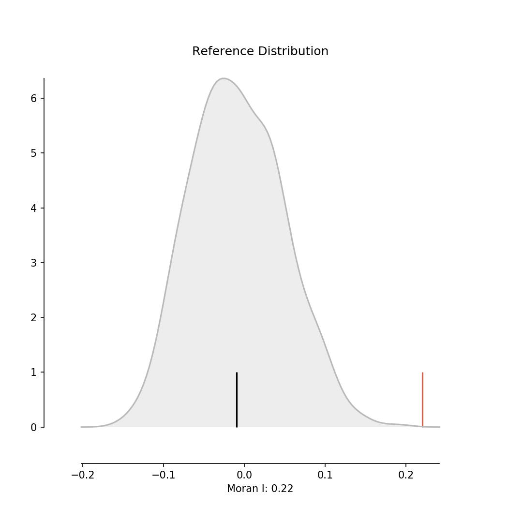
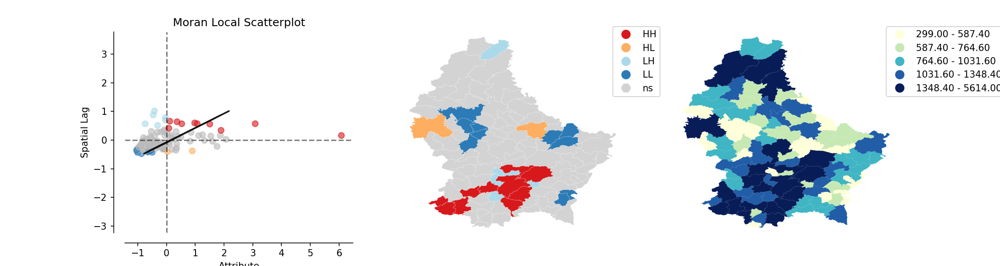

# Spatial Autocorrelation

## Spatial Lag

Product of a spatial weights matrix W and a given variable Y

$$
Y_{sl} = WY
$$

$$
y_{sl-i} = \sum_j w_{ij} \; y_j
$$

## Global

This is the pitch, but it isn't helpful: the reification of autocorrelation actually obscures model mis-specification - there may be no autocorrelation at all in a properly specified mean model.

> *Everything is related to everything else, but near things are more related than distant things*

Tobler (1970, contradicted by Gunnar Olsson in the same issue of *Economic Geography*)

[`URL`](http://mybinder.org/repo/darribas/int_sp_auto)

### Moran Plot

### Moran's I

$$
I = \dfrac{N} {\sum_{i} \sum_{j} w_{ij}} \dfrac {\sum_{i} \sum_{j}
w_{ij}(Z_i) (Z_j)} {\sum_{i} (Z_i)^2}
$$

Inference through *permutations*

This is wrong, the original inference based on analytical randomisation is fine, permutations give no benefit. Exact and saddlepoint approximation inference is also available.

## Local

Cluster*ing* Vs Cluster*s*

Local Moran's I (Anselin, 1996):

$$
I_i = \frac{Z_i}{m_2} \sum_j W_{ij} Z_j \; \; ; \; \;  m_2= \frac{\sum_i Z_i^2
}{N}
$$

Inference through *permutations*

Again, this is wrong, exact or saddlepoint is adequate, but permutation is definitely wrong. The real problem is mean model mis-specification, and omitting global autocorrelation when testing for local autocorrelation. Not to mention multiple comparisons!

## Sources

* [SDSR](https://keen-swartz-3146c4.netlify.com/area-data-and-spatial-autcorrelation.html)
* [Test: Bivand and Wong, 2018](https://rdcu.be/bLVB4), (http://dx.doi.org/10.1007/s11749-018-0599-x)
* [GDS Book - Global chapter](https://geographicdata.science/book/notebooks/06_spatial_autocorrelation.html)
* [GDS Book - Local chapter](https://geographicdata.science/book/notebooks/07_local_autocorrelation.html)
* [GDS'19 - Spatial Autocorrelation lecture](http://darribas.org/gds19/notes/Class_06.html)
* [GDS'19 - Spatial Autocorrelation lab](http://darribas.org/gds19/labs/Lab_06.html)
